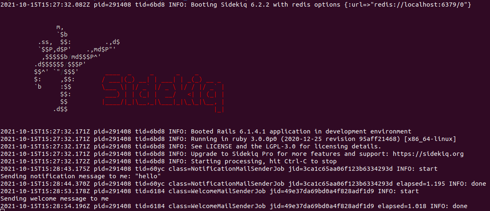
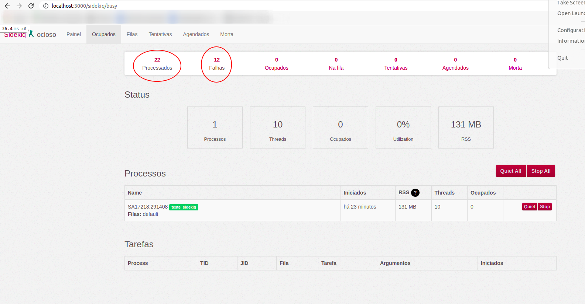

# README

## Requirements

* Ruby
* Rails
* Redis-server
* Sidekiq

## Getting Started

Para transformar a chamada do dos métodos em não bloqueantes escolhi enfileirá-los para que eles fossem executados de maneira assíncrona. Para isso foi utilizado o agendador de tarefas `Sidekiq`. Para tal uso do  foi necessário adicionar ao `Gemfile` a `gem 'sidekiq'`.

Após adicionar a gem necessária, criei os jobs `WelcomeMailSenderJob` e `NotificationMailSenderJob`.

Para executar os jobs basta rodar o `redis-server`, o sidekiq (abrindo o terminal dentro da pasta do projeto e executando `sidekiq`) e em seguida abrir o rails console (`rails c`) e executar os seguintes comandos:

```
NotificationMailSenderJob.perform_later('me','hello')
```
e

```
WelcomeMailSenderJob.perform_later('me')
```
É possivel observar as saídas pelo terminal em que o sidekiq está sendo executado, exemplo: 



Outra maneira de observar os enfileiramentos é subindo o servidor da aplicação (`rails s`) e acessando `localhost:3000/sidekiq`: 



> Cada vez que os comandos de execução dos jobs forem rodados o número de **processados** na página `localhost:3000/sidekiq` aumenta.


